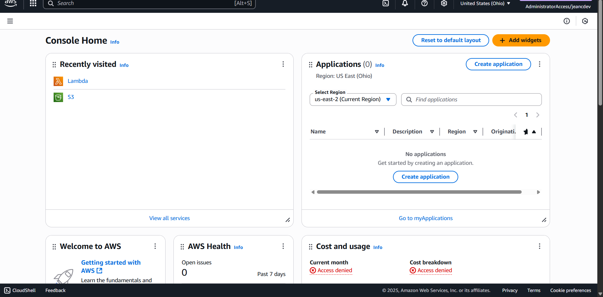
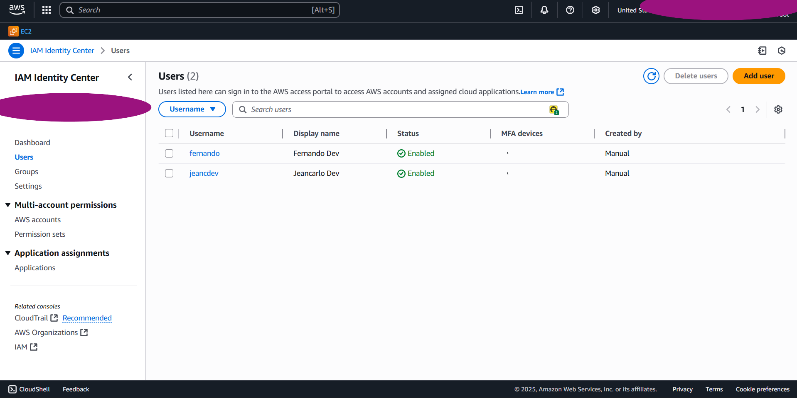
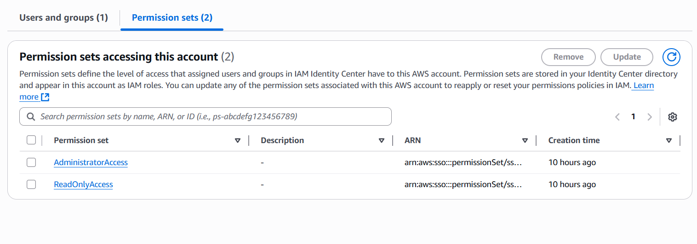
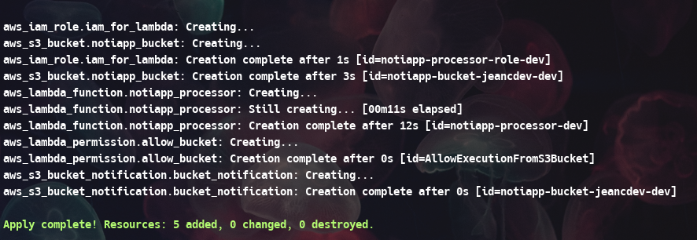
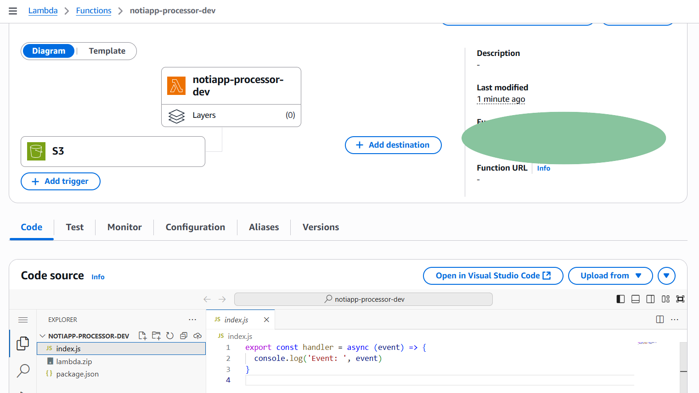
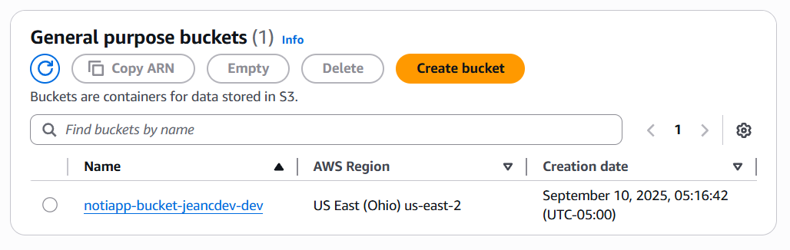

# Terraform + AWS

## 🏗️ Arquitectura

- **S3 Bucket**: Almacenamiento de archivos de logs
- **Lambda Function**: Procesador de eventos S3 (Node.js 22.x)
- **IAM Roles**: Permisos para la función Lambda
- **S3 Notifications**: Trigger automático al subir archivos `.log`

## 📋 Requisitos Previos

1. **Node.js** (v18 o superior)
2. **Terraform** (v1.0 o superior)
3. **AWS CLI** configurado con perfil `jeancdev`
4. **Git** para control de versiones

## 🚀 Configuración Inicial

### 1. Clonar e instalar dependencias

```bash
git clone <repository-url>
cd 03-infraestructura
npm install
```

### 2. Configurar AWS CLI

```bash
aws configure --profile jeancdev
# Ingresar AWS Access Key ID, Secret Access Key, región (us-east-2)
```

### 3. Inicializar Terraform

```bash
cd iac
terraform init
terraform workspace new dev
terraform workspace select dev
```

## 🏃‍♂️ Despliegue

### Planificar cambios

```bash
cd iac
terraform plan
```

### Aplicar infraestructura

```bash
terraform apply
```

### Verificar recursos creados

```bash
terraform show
```

## 🔄 Desarrollo Local

### Commits con formato estándar

```bash
npm run commit
```

### Validaciones automáticas

```bash
npm run validate
```

### Trabajar con ramas

```bash
git checkout -b feature/nueva-funcionalidad
npm run commit
git push origin feature/nueva-funcionalidad
```

## 🧹 Limpieza

### Destruir infraestructura

```bash
cd iac
terraform destroy
```

## 📁 Estructura del Proyecto

```
├── iac/                    # Configuración Terraform
│   ├── main.tf            # Proveedor AWS
│   ├── variables.tf       # Variables del proyecto
│   ├── bucket.tf          # Configuración S3
│   ├── lambda.tf          # Función Lambda
│   └── iam.tf             # Roles y permisos
├── src/
│   └── index.js           # Código de la función Lambda
├── .husky/                # Git hooks
├── package.json           # Dependencias Node.js
└── commitlint.config.js   # Configuración de commits
```

## 🌍 Entornos

- **dev**: Desarrollo (`terraform workspace select dev`)
- **qa**: Testing (crear con `terraform workspace new qa`)
- **prod**: Producción (crear con `terraform workspace new prod`)

## 📝 Variables de Entorno

| Variable               | Descripción                 | Default                   |
| ---------------------- | --------------------------- | ------------------------- |
| `bucket_name`          | Nombre base del bucket S3   | `notiapp-bucket-jeancdev` |
| `lambda_function_name` | Nombre de la función Lambda | `notiapp-processor`       |
| `environment`          | Entorno de despliegue       | `dev`                     |
| `region`               | Región de AWS               | `us-east-2`               |

## 🔧 Comandos Útiles

```bash
# Ver workspaces de Terraform
terraform workspace list

# Cambiar workspace
terraform workspace select <nombre>

# Ver estado actual
terraform state list

# Importar recursos existentes
terraform import <resource> <id>

# Formatear código Terraform
terraform fmt

# Validar configuración
terraform validate
```

## Imagenes de pantalla








